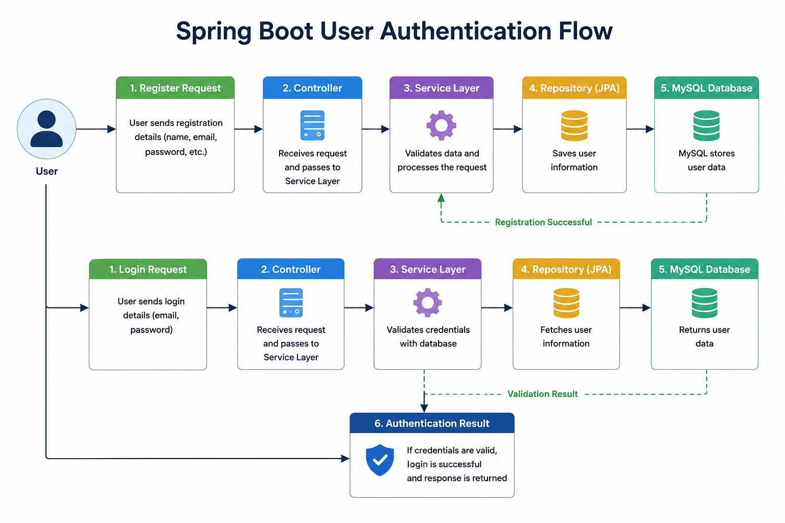

# 🔐 Spring Boot: User Authentication

A Spring Boot REST API application that demonstrates **User Registration** and **User Login** using Spring Boot. The project follows a clean layered architecture with DTOs, request validation, exception handling, and MySQL database integration to build a simple authentication system.

---

## ⚙️ What This Covers

✔ User Registration

✔ User Login

✔ Request Validation

✔ Global Exception Handling

✔ DTO-Based Request & Response

✔ MySQL Database Integration

✔ RESTful API Development

---

## 🛠️ Tech Stack

| Category | Technologies |
|----------|--------------|
| **Backend** | Java 17, Spring Boot, Spring Security |
| **Database** | MySQL, Spring Data JPA |
| **Validation** | Jakarta Bean Validation |
| **API Testing** | Postman |
| **Build Tool** | Maven |

---

## 📡 REST API Endpoints

| Method | Endpoint | Description |
| ------ | -------- | ----------- |
| POST | `/register` | Register a new user |
| POST | `/login` | Login with registered credentials |

---

## 🚀 Authentication Flow

  

---

## 🎯 Conclusion

👉 *This repository demonstrates the fundamentals of implementing user registration and login in Spring Boot. It showcases a clean REST API structure with validation, exception handling, and MySQL integration, providing a solid foundation for building more advanced authentication systems such as JWT or OAuth in the future.*

---

⭐ Thank You for Visiting This Repository ⭐

