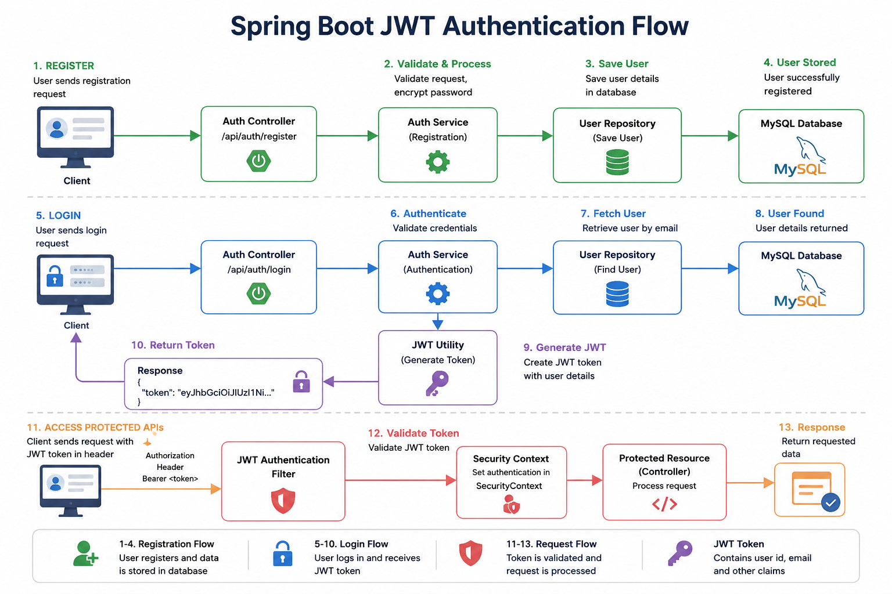

# 🔐 Spring Boot: User Authentication

A Spring Boot REST API Application that demonstrates complete **User Authentication** using **JWT (JSON Web Token)** and **Spring Security**. The application follows clean architecture principles with DTOs, request validation, global exception handling, password encryption using BCrypt, and MySQL integration.

This project serves as a solid foundation for building secure authentication systems in enterprise Spring Boot applications.

---

## ✨ Features

✔ User Registration, Login, Update Profile & Delete Profile

✔ JWT Token Generation,  Authentication & Authorization

✔ BCrypt Password Encryption

✔ Request Validation

✔ Global Exception Handling

✔ Spring Security Integration

✔ Stateless Authentication

✔ Global Exception Handling

✔ DTO-Based Request & Response

---

## 🛠️ Tech Stack

| Category | Technologies |
|----------|--------------|
| **Backend** | Java 17, Spring Boot 3, Spring Security |
| **Authentication** | JWT (JSON Web Token), BCrypt Password Encoder |
| **Database** | MySQL, Spring Data JPA, Hibernate |
| **Validation** | Jakarta Bean Validation |
| **Build Tool** | Maven |
| **API Testing** | Postman |
| **IDE** | IntelliJ IDEA |

---

## 🔐 Authentication Flow

  

---

## 📡 REST API Endpoints

| Method | Endpoint | Authentication | Description |
|---------|----------|---------------|-------------|
| POST | `/api/auth/register` | ❌ | Register a new user |
| POST | `/api/auth/login` | ❌ | Login and receive JWT token |
| GET | `/api/auth/profile` | ✅ Bearer Token | Get logged-in user profile |
| PUT | `/api/auth/update/{id}` | ✅ Bearer Token | Update user details |
| DELETE | `/api/auth/delete/{id}` | ✅ Bearer Token | Delete user account |

---

## 👨‍💻 Author

**Pavan Sonawane**

GitHub: https://github.com/pavan0209

LinkedIn: https://www.linkedin.com/in/pavansonawane0209

---

⭐ Thank You for Visiting This Repository ⭐

